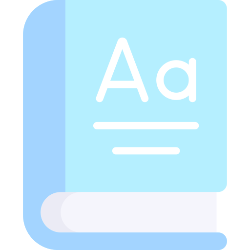

<div align="center" id="top"> 
  

&#xa0;

<a href="https://dictionary-app-omega.vercel.app">Demo</a>

</div>

<h1 align="center">Dictionary</h1>

<p align="center">
  
  
  
  
  
  
</p>

<!-- Status -->

<h4 align="center">
	🚧  Dictionary 🚀 Under construction...  🚧
</h4>

<hr>

<p align="center">
  <a href="#dart-about">About</a> &#xa0; | &#xa0; 
  <a href="#sparkles-features">Features</a> &#xa0; | &#xa0;
  <a href="#rocket-technologies">Technologies</a> &#xa0; | &#xa0;
  <a href="#white_check_mark-requirements">Requirements</a> &#xa0; | &#xa0;
  <a href="#checkered_flag-starting">Starting</a> &#xa0; | &#xa0;
  <a href="#memo-license">License</a> &#xa0; | &#xa0;
  <a href="https://github.com/tia-cin" target="_blank">Author</a>
</p>

<br>

## 📌 About

Discover any word meanings, definitions and more

## ✨ Features

✅ Search any english word <br>
✅ Choose a result and explore its differences <br>
✅ Learn their phonetics <br>
✅ Explore the antonyms and sinonyms <br>

## 🚀 Technologies

The following tools were used in this project:

- [React](https://pt-br.reactjs.org/)
- [Redux](https://redux.org/)

## ✔️ Requirements

Before starting ❗, you need to have [Git](https://git-scm.com) and [Node](https://nodejs.org/en/) installed.

## 🚩 Starting

```bash
# Clone this project
$ git clone https://github.com/tia-cin/dictionary

# Access
$ cd dictionary

# Install dependencies
$ yarn

# Run the project
$ yarn start

# The server will initialize in the <http://localhost:3000>
```

Made with 💛 by <a href="https://github.com/tia-cin" target="_blank">Cintia Arce</a>

&#xa0;

<a href="#top">Back to top</a>
